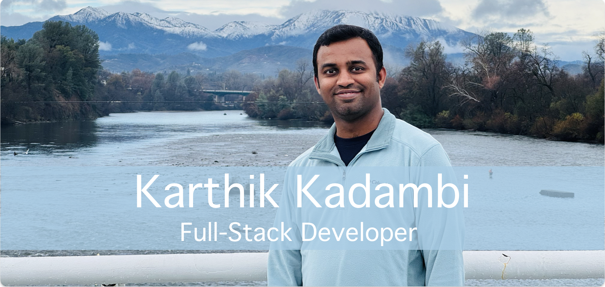

<!--
**KarthikKadambi/KarthikKadambi** is a ✨ _special_ ✨ repository because its `README.md` (this file) appears on your GitHub profile.

Here are some ideas to get you started:

- 🔭 I’m currently working on ...
- 🌱 I’m currently learning ...
- 👯 I’m looking to collaborate on ...
- 🤔 I’m looking for help with ...
- 💬 Ask me about ...
- 📫 How to reach me: ...
- 😄 Pronouns: ...
- ⚡ Fun fact: ...
-->

## About Me

Thanks for dropping by! I like to code and build amazing products.
🐻 🐘

- 🔭 I’m currently working on an amazing product🤫.
- 🌱 I’m currently learning about perfecting full stack development.
- 👯 I’m looking to collaborate on JavaScript.
- 🤔 I’m looking for help with Product Building, Graphic Design.
- 💬 Ask me about: Personal Finance, Fullstack development with JavaScript.
- 📫 How to reach me: https://karthikkadambi.com
- 😄 Pronouns: he/him.
- 📄 Know about my experiences: https://www.linkedin.com/in/kkadambi
- ⚡ Fun fact: Trying to start my long term passion of learning a music instrument.
  
## Skills

### Programming Languages

### Frontend development

### Backend development

### Mobile app development
⏳

### AI/ML
⏳

### Database

### Data Vizualization
⏳

### Devops

### Backend as a service
⏳

### Framework

### Testing

### Tools

### Static Site Generators

### Markup language 

## Stats

&nbsp;

